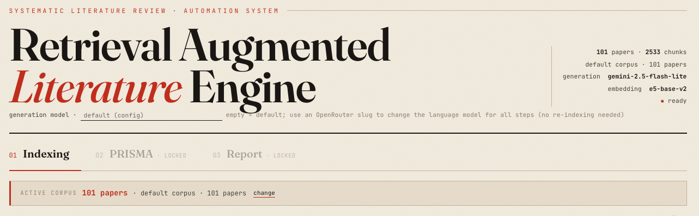

<!--
  TITLE + HERO: working title below is "Retrieval-Augmented Literature Engine" (matches the app's
  display name). Swap it for the final title when decided. Replace docs/screenshot.png with a real
  screenshot of the running app (the user will provide one).
-->

<h1 align="center">Retrieval-Augmented Literature Engine</h1>

<p align="center">
  Open, end-to-end, retrieval-augmented systematic-literature-review automation:
  <br>index a corpus, screen with PRISMA, extract structured data, and synthesise research questions,
  <br>with every produced claim traceable to a clickable <code>[P###]</code> source citation.
</p>

<p align="center">
  
  
  
  
  <a href="https://doi.org/10.5281/zenodo.21205679"></a>
</p>

<p align="center">
  
</p>

## Overview

Existing tools automate only part of a systematic literature review (SLR): some do only screening
(e.g. ASReview), some only question answering. This system unifies **screening, extraction, and
synthesis** in a single locked workflow and binds every produced piece of information to its
source. Citations are reconciled on the server and each extracted field is grounded in a verbatim
quote, so fabricated citations and unverifiable values are flagged rather than shown as fact. It is
a single-user, localhost research tool built on hybrid retrieval (dense `e5-base-v2` + BM25 + RRF +
a cross-encoder reranker), a ChromaDB vector store, and an OpenRouter-compatible LLM client with a
local `sentence-transformers` fallback.

## Data handling

The corpus, the vector index, and all outputs are written to your machine (`data/`). Text is sent
to a third party only for the model calls: embeddings and the three LLM stages (screening,
extraction, synthesis) call the [OpenRouter](https://openrouter.ai) API by default. Without an API
key, embeddings fall back to a **local** model (indexing and raw retrieval run fully offline) and
the LLM stages are disabled with a clear error.

## Get started

**Requirements.** Python 3.11+. An [OpenRouter](https://openrouter.ai/keys) API key is optional for
indexing/retrieval and required for the screening/extraction/synthesis stages. A free OpenRouter
account and its free-tier models are sufficient to run the whole pipeline; the language model is
configurable per request, so you supply and choose your own.

**Quick start.**

```bash
bash scripts/setup.sh              # create .venv, install dependencies, prepare .env
.venv/bin/python build_index.py    # index the bundled sample corpus (32 open-access papers)
bash scripts/run.sh                # http://127.0.0.1:8000
```

A fresh clone ships with a small, license-clean **sample corpus** (`data/sample/`, 32 redistributable
CC BY / CC BY-SA arXiv papers) so the full flow runs immediately. Add `OPENROUTER_API_KEY=...` to
`.env` to enable the LLM stages. On Windows: `scripts\setup.ps1` then `scripts\run.ps1`.

**End-to-end demonstration.** To exercise the whole pipeline in one command, run:

```bash
.venv/bin/python demonstration.py   # index -> screen -> extract -> synthesize -> SHA-256 check
```

It runs all four stages over the bundled sample corpus and prints a per-stage throughput funnel
(papers indexed, included/excluded at screening, extracted, and citations resolved at synthesis),
then writes the full result to `data/sample/example_output.json`. That output file is committed, so
you can inspect the expected shape without running anything. The screening, extraction, and synthesis
stages call an LLM, so they need `OPENROUTER_API_KEY` set; indexing and retrieval run offline. This is
a throughput and behaviour demonstration that the software runs end to end, not an accuracy benchmark.

## How it works

The interface is a locked three-step wizard; each step consumes the previous step's output.

1. **Indexing.** Build the corpus (bundled pool, uploaded PDFs, or an arXiv query). Text is split
   into paragraph-based overlapping chunks, embedded, and stored in Chroma.
2. **PRISMA.** Screen each paper against your inclusion/exclusion criteria over retrieved evidence
   in two stages (title/abstract, then full text). Output: a PRISMA 2020 flow diagram and decision list.
3. **Report.** Extract structured fields (each grounded in a source quote) and synthesise research
   questions from the included papers, combined into one report with clickable `[P###]` citations.

A full walkthrough is in [USAGE.md](USAGE.md).

## REST API

```
GET  /api/health        corpus + model status
GET  /api/papers        list papers in the active corpus
POST /api/ingest/pool   build the index from the bundled/baseline pool
POST /api/ingest/upload build the index from uploaded PDFs
POST /api/fetch         fetch + index papers from arXiv by query
POST /api/prisma        batch screening + PRISMA 2020 flow          (needs API key)
POST /api/screen        include/exclude decision for one paper       (needs API key)
POST /api/extract       structured extraction for one paper          (needs API key)
POST /api/synthesize    corpus-wide synthesis for a research question (needs API key)
POST /api/report        end-to-end PRISMA + extraction + synthesis    (needs API key)
GET  /api/retrieve      raw retrieval, no LLM call
POST /api/export        download the last result as CSV/JSON/PDF
POST /api/verify        verify the SHA-256 integrity of a downloaded output
```

## Configuration

Defaults live in `config.py`: embedding `intfloat/e5-base-v2` (768-d), chunk ~350 words, reranker
`ms-marco-MiniLM-L-6-v2`, default language model `gemini-2.5-flash-lite`. The language model and
extraction fields are configurable per request; changing the embedding model or chunk size requires
re-indexing. When an external baseline corpus is present at `../slr/data/` it is used automatically;
otherwise the bundled sample corpus is used.

## Project structure

```
app.py            FastAPI web application + REST API
build_index.py    CLI indexer
config.py         paths, model names, parameters (auto-selects baseline or bundled sample corpus)
static/           single-page interface
data/sample/      bundled, license-clean sample corpus (32 CC BY / CC BY-SA arXiv papers)
src/
  indexing/       corpus, chunker, embedder, vector_store
  retrieval/      dense / hybrid (RRF) / reranker
  llm/            OpenRouter client + prompt templates
  tasks/          screening / extraction / synthesis
  evaluation/     metrics, normalization, grounding, citation reconciliation
tests/            unit tests (pytest)
docs/             images used by this README
```

Run the tests (torch-free: needs only pytest, scikit-learn, and scipy, no API key or network):

```bash
.venv/bin/pip install -r requirements-dev.txt   # already installed by scripts/setup.sh
.venv/bin/python -m pytest tests/ -q            # 73 tests
```

## Contributing

Issues and pull requests are welcome. Please run the test suite (`pytest -q`) before opening a PR.

## Citing

If you use this software, please cite it via [CITATION.cff](CITATION.cff) (GitHub's "Cite this
repository" produces APA/BibTeX from it).

## License

MIT license; see [LICENSE](LICENSE). The bundled sample corpus is redistributed under CC BY 4.0 with
attribution in [data/sample/README.md](data/sample/README.md).
